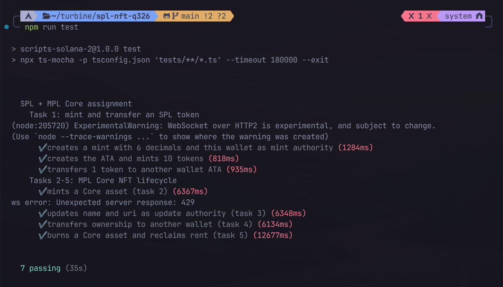

# DeEvil — SPL token + MPL Core NFT (devnet)

TypeScript scripts that talk to programs already on Solana. Nothing here is an on-chain program; the work is building and sending the right transactions.

| Task | Status |
|---|---|
| 1. Mint and transfer an SPL token | Done on devnet |
| 2. Mint an NFT with MPL Core | Done on devnet |
| 3. Update name/metadata as update authority | Done on devnet |
| 4. Transfer NFT ownership | Script + tests |
| 5. Burn an NFT and reclaim rent | Script + tests |

All of this runs on **devnet**.

## Proof



### SPL token — `DeEvil` / `EVIL`

| | |
|---|---|
| Mint | [`8pm8BQiw1dJusSqy5vH8Um2iarZtKDe2CvjijSqJtVQP`](https://explorer.solana.com/address/8pm8BQiw1dJusSqy5vH8Um2iarZtKDe2CvjijSqJtVQP?cluster=devnet) |
| Decimals | 6 |
| Supply | 10 tokens (9 in my ATA, 1 transferred) |
| Create mint | [`65kezUyF…S1uo`](https://explorer.solana.com/tx/65kezUyFRXp3LXwFtanVuK9eZW3aTsGJZRXi5GPH94Pc5TW1jiSxGwNb1QPpvHwcpVaREEiRsKK1Q5AA4F6rS1uo?cluster=devnet) |
| Token metadata | [`xTVa7Vbi…cNK`](https://explorer.solana.com/tx/xTVa7Vbi9vUkH8VjndNUZYR1H2GxXYaNLLWHTtJUA41rMF8qmmfCxbB9p4MxuDMXuqs8ZsiM7zhxwJ2Ki4Z2cNK?cluster=devnet) |
| Image | [Irys](https://gateway.irys.xyz/AvNxi1wpjBG6iw2yP7o8uRuLFaXXbFYy3er4rwWVojgL) |
| Metadata JSON | [Irys](https://gateway.irys.xyz/Fpx64Uk3gwKu76Gjds7SapRtBNMjeodbESpQJ2qUDwwp) |
| Metadata update | [`2HKM5aXY…GtnF`](https://explorer.solana.com/tx/2HKM5aXYe5YwKWSfvcSgyF3NdWgNdWrXs9epuXoPvom3Hk6ymVc1mvCD9ZvixpFNBpJrauqPoYyCL9PxXDWbGtnF?cluster=devnet) |
| Mint 10 tokens | [`3j8F7gpY…7h8k`](https://explorer.solana.com/tx/3j8F7gpYCPpd537bbfTqzFQSnomCzxwnWFAU9Dn7mJZzjQ8Unv3a4wJ5AAp4PuKwGLxL8KsMxvNyP41Nvf6S7h8k?cluster=devnet) |
| Transfer 1 token | [`39wd2tdY…xCAs`](https://explorer.solana.com/tx/39wd2tdYKnUirRgS1UXFTGTfzovVUWn3HdkyorHGbFCzPR2r7nBsdU54DpRzHRayPLiZWTLH4ik9xSZY7jrhxCAs?cluster=devnet) |

### MPL Core NFT — `DeEvil Updated`

| | |
|---|---|
| Asset | [`3h1ofrenGXStorpdomnho9NBDoyFr6n2i1uxGRks3yr2`](https://explorer.solana.com/address/3h1ofrenGXStorpdomnho9NBDoyFr6n2i1uxGRks3yr2?cluster=devnet) |
| Core explorer | [core.metaplex.com](https://core.metaplex.com/explorer/3h1ofrenGXStorpdomnho9NBDoyFr6n2i1uxGRks3yr2) |
| Image | [Irys](https://gateway.irys.xyz/AvNxi1wpjBG6iw2yP7o8uRuLFaXXbFYy3er4rwWVojgL) |
| Metadata JSON | [Irys](https://gateway.irys.xyz/5KAJKWgMZa1VHY1CKbAqX1AYcoKN9g4PHeGYDrD6GwDo) |
| Create | [`2zKAoq1k…oc8`](https://explorer.solana.com/tx/2zKAoq1kgxyZQqM4JbEQ5xDfXAebzoe2KKinznTtSW3v6P2PSQYvaW4Dn9TXKu9zstf7cWvau9stKutP2sgJoc8?cluster=devnet) |
| Update name | [`5mXdYEq7…R27q`](https://explorer.solana.com/tx/5mXdYEq7MfsUXZiZi8PKtTSD4RY4PoLd9P2uP1Pe59ttm5ZLUmS1G4z8azc5Bkom6Duxhoh2PUQgz6VXfoHJR27q?cluster=devnet) |
| Burn + rent reclaim | [`3QnEbS4t…srSP`](https://explorer.solana.com/tx/3QnEbS4tCviaTaKg3TF5VsMQyjwwbzFPPu2ZQ7qFpiwwLecFQLocKo5h3CHJm75f4vddqz3DkxRKyy7hKMhSsrSP?cluster=devnet) |

On-chain name after the update is **DeEvil Updated**. Update authority is still the minting wallet.

The showcase NFT is left intact. Task 4 (transfer) is covered by `npm test` and `npm run nft:transfer`. Task 5 burned a spare Core asset (`6PnLn5w1PQpSKspozq2KNibsx2GR1XfjnYX68T571MRN`) and returned rent to the wallet so DeEvil stays visible on explorer.

## How it is structured

```
src/spl/     Kit + SPL Token program (fungible token)
src/nft/     UMI + Irys + MPL Core (NFT)
tests/       Same operations against devnet, with assertions
image.jpeg   Artwork uploaded to Irys
```

**SPL path:** a mint account is the token’s identity. Balances live in Associated Token Accounts, not on the wallet itself. Transfer is ATA → ATA (`TransferChecked`, 6 decimals). Metaplex Token Metadata attaches the name `DeEvil` / symbol `EVIL`, with the logo hosted on Irys.

**Core path:** one Asset account is the whole NFT. Image and JSON sit off-chain on Irys; the asset only stores `name` + `uri`. Update authority can change those fields. Owner can transfer or burn. Burning closes the account and returns most of the rent. A tiny leftover stays so the address cannot be reused.

Two JavaScript SDKs are used on purpose, matching the boilerplate:

- `@solana/kit` + `@solana-program/token` for SPL instructions
- UMI + `@metaplex-foundation/mpl-core` for Core + uploads

## Setup

1. Node 20+.
2. Put a **devnet** keypair at `devnet-wallet.json` (JSON byte array). It is gitignored. Do not commit it.
3. Put artwork at `image.jpeg`.
4. Fund the wallet (~1 SOL on devnet is enough). [Faucet](https://faucet.solana.com/).
5. `npm install`

```bash
solana-keygen new --outfile devnet-wallet.json --no-bip39-passphrase
solana airdrop 2 "$(solana-keygen pubkey devnet-wallet.json)" --url devnet
```

## Commands

Run in order. Each script prints an address or URI the next one needs.

```bash
npm run spl:init        # create mint
npm run spl:metadata    # name / symbol / uri
npm run spl:mint        # ATA + 10 tokens
npm run spl:transfer    # 1 token to the recipient wallet

npm run nft:image       # upload image.jpeg to Irys
npm run nft:metadata    # upload JSON
npm run nft:mint        # create Core asset
npm run nft:update      # change on-chain name as update authority
npm run nft:transfer    # change owner
npm run nft:burn        # mint a spare asset and burn it (reclaims rent)

npm test                # full flow on fresh accounts
```

`spl:mint` / `spl:transfer` will error with “already in use” on a second run because they create ATAs. That is expected.

`nft:burn` mints a **new** Core asset and burns that one, so the DeEvil NFT in the table above is not destroyed.

## Tests

`tests/assignment.test.ts` repeats the assignment against devnet with this wallet:

1. Create a mint (6 decimals), mint 10 tokens, transfer 1, assert balances.
2. Create a Core asset, update name/uri, transfer ownership, then mint a second asset and burn it, asserting rent came back.

```bash
npm test
```

Needs `devnet-wallet.json` and a few tenths of a SOL. Takes about a minute. Screenshot the green output and save it as `docs/screenshots/tests-passing.png`.

## Notes

- Amounts are in base units. `token_decimals = 1_000_000n` means 6 decimal places, so `10n * token_decimals` is 10.000000 tokens.
- Update authority and owner are different roles. After a transfer, the original wallet can still update metadata if it kept update authority, but it can no longer burn.
- Core `update` / `transfer` / `burn` want the fetched asset object (owner, plugins), not only the public key.
- Irys uploads spend a little devnet SOL and can flake; retry if the bundler times out.
